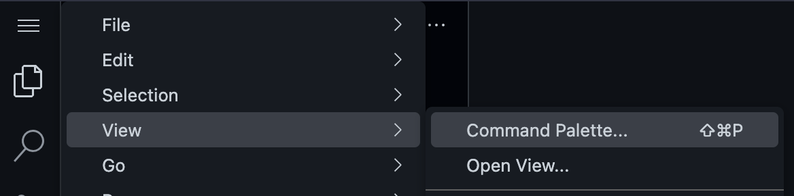
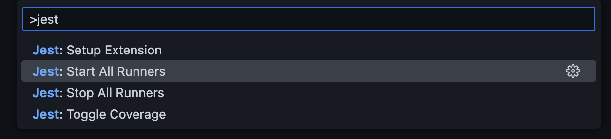
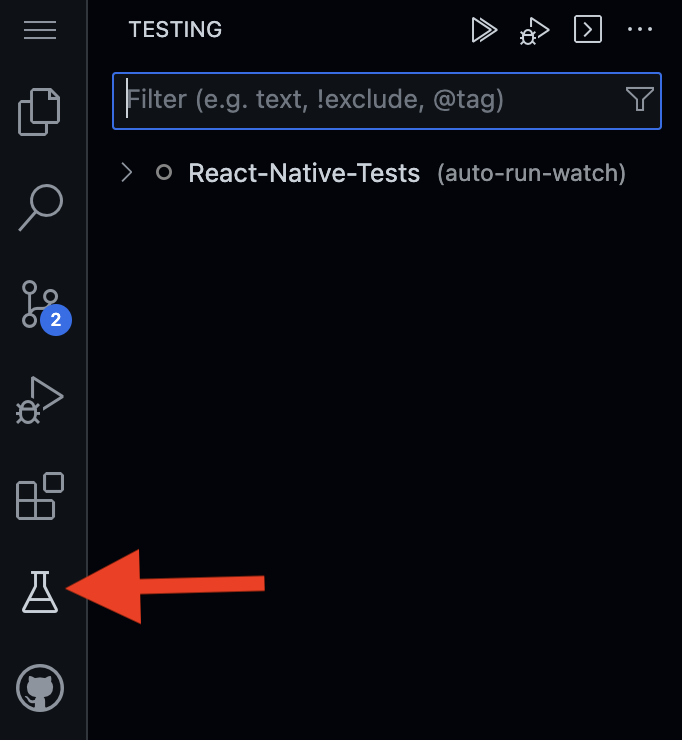
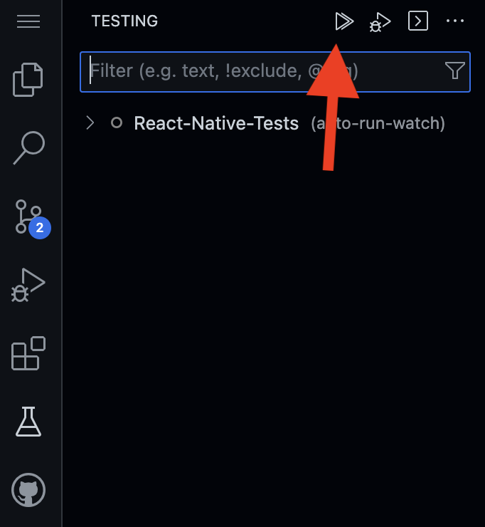
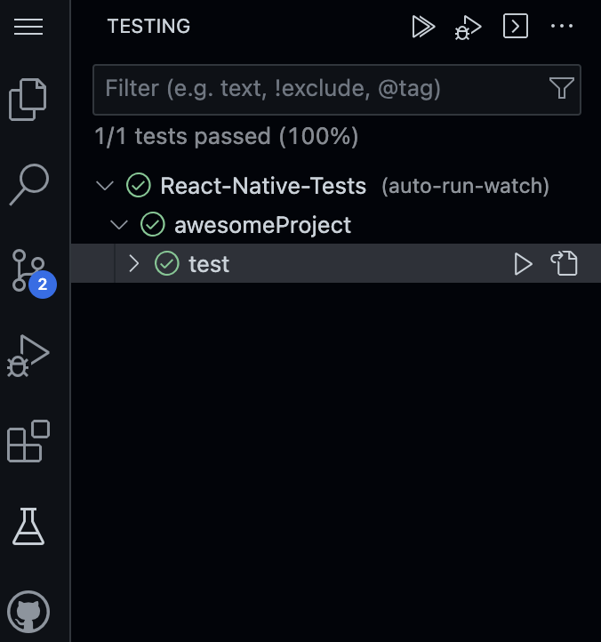

# IMPORTANT!
## Wait for VSCode to finish setting up dependencies

1. Once VSCode opens for the first time you should briefly see the following in the terminal. 

2. hen it should quickly change to following and will run for a few minutes.

3. Once packages and dependencies required for the project are all installed, you will see the following for a brief moment:

4. Then it should change to this, indicating the Editor is ready to use:

## Launch Test Suite.

1. Open App Menu by clicking Burger Icon in Top Left corner:

2. Find and open Command Pallet:

3. Once Command Pallete opened type in "jest" and select "Jest: Start All Runners":

4. You should notice new Test View in Activity Bar on a left land side. Click on it:

4. Once expanded, click "Run all tests" action:

5. You shoul see the results of running tests similar to this:
